# llm.port

> **[Documentation & Screenshots → llm-port.github.io](https://llm-port.github.io)**

**llm.port** is a self-hosted **all-in-one LLM platform** that combines:

- an OpenAI-compatible gateway for app traffic
- a built-in chat console with sessions, memory, and file attachments
- control-plane operations for model servers and runtime infrastructure
- an internal RAG subsystem for ingestion, indexing, and governed retrieval
- PII detection and redaction integrated into the gateway pipeline
- notification delivery for system alerts and user workflows

It **routes, secures, and observes** traffic across **local LLM runtimes** _and_ **remote providers**, while giving teams a single place to manage LLM services end-to-end.

## Architecture

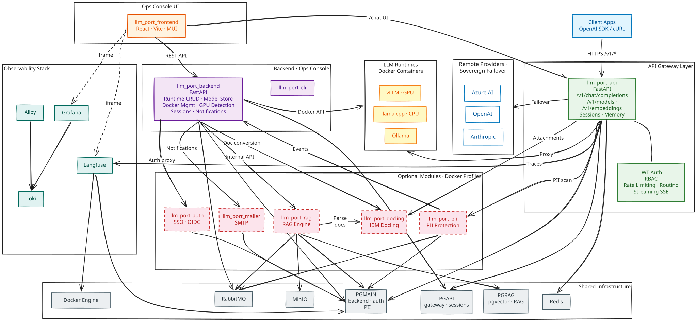

---

## Screenshots

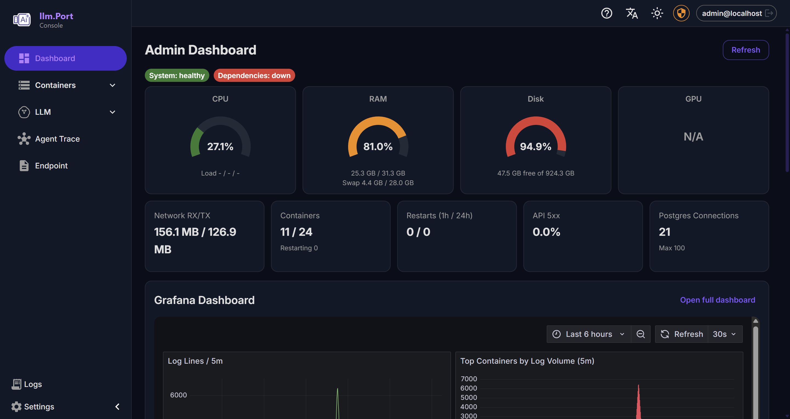

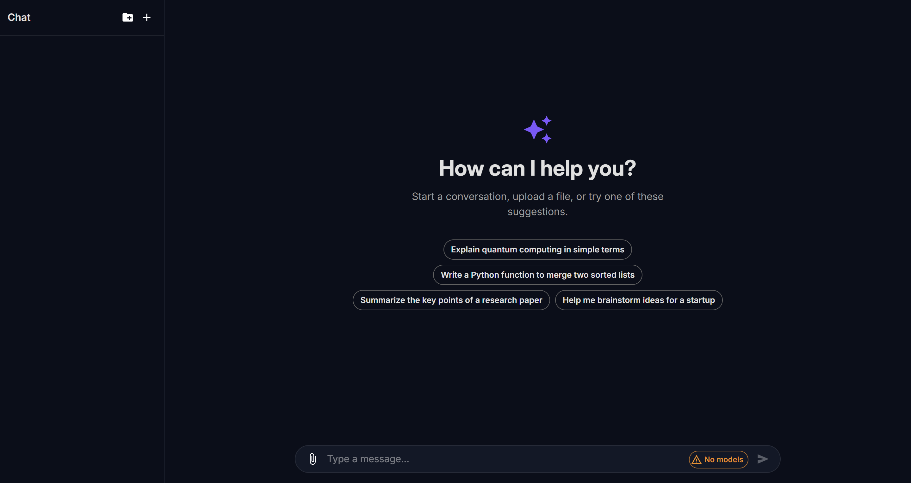

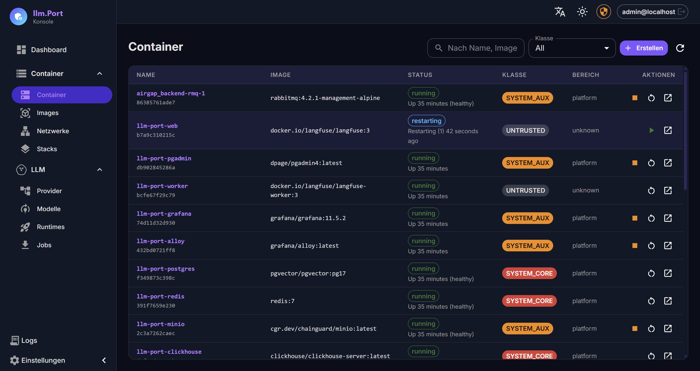

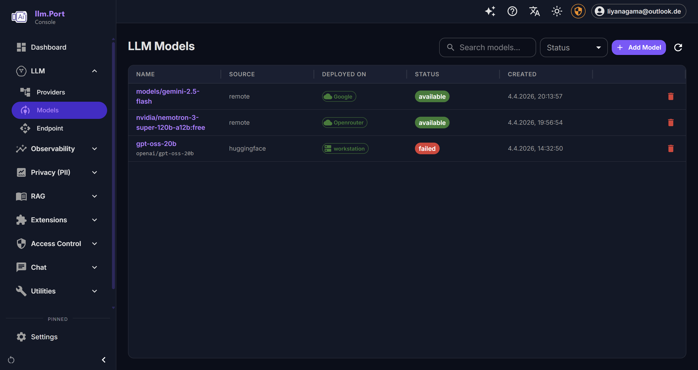

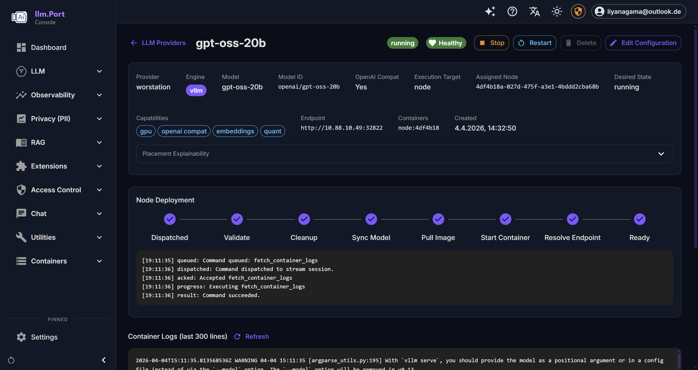

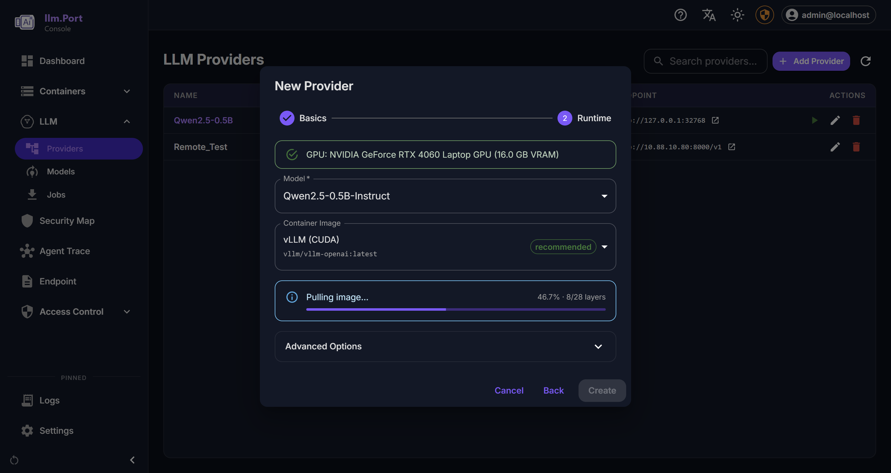

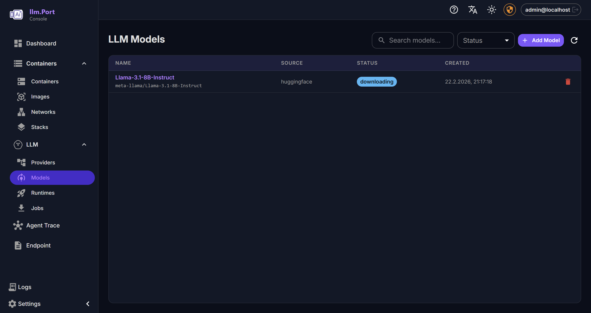

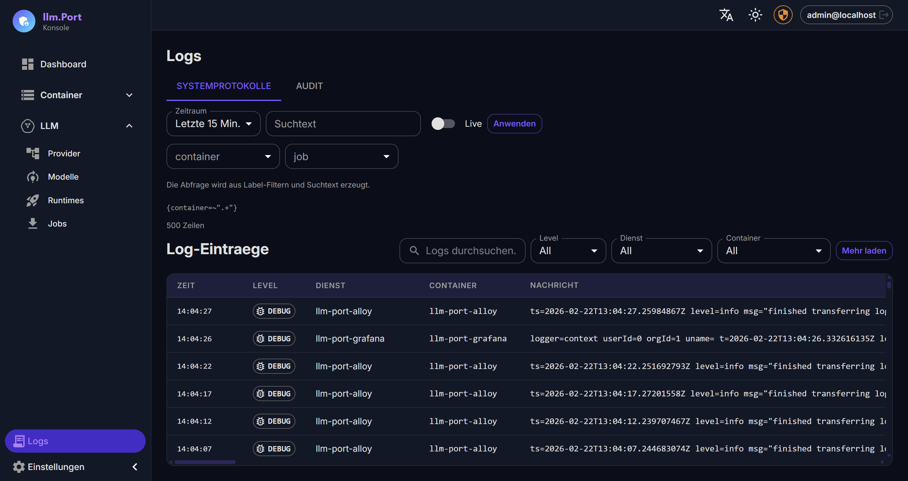

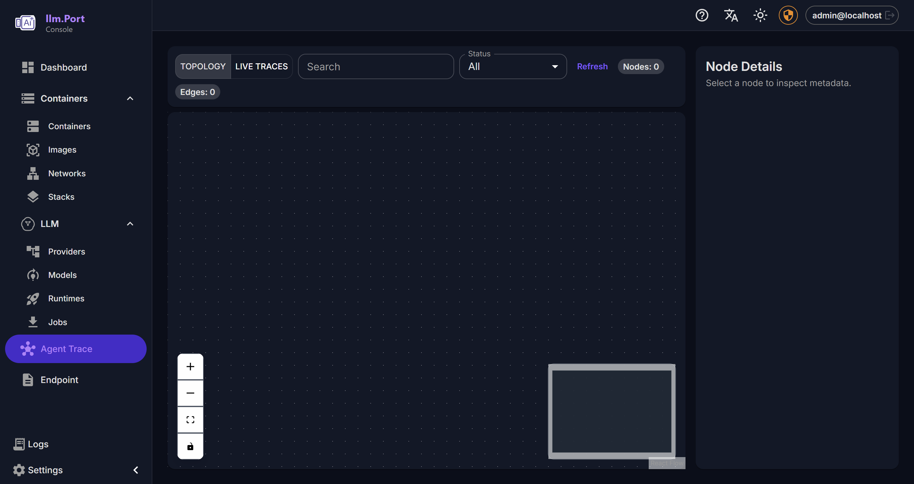

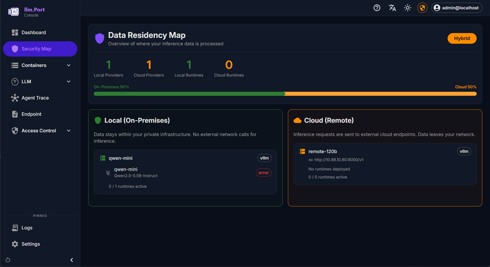

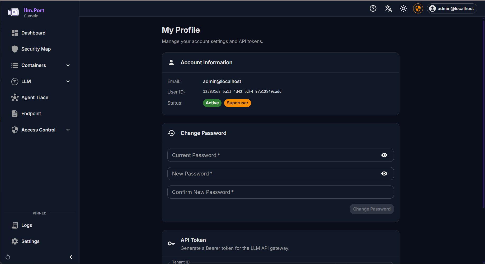

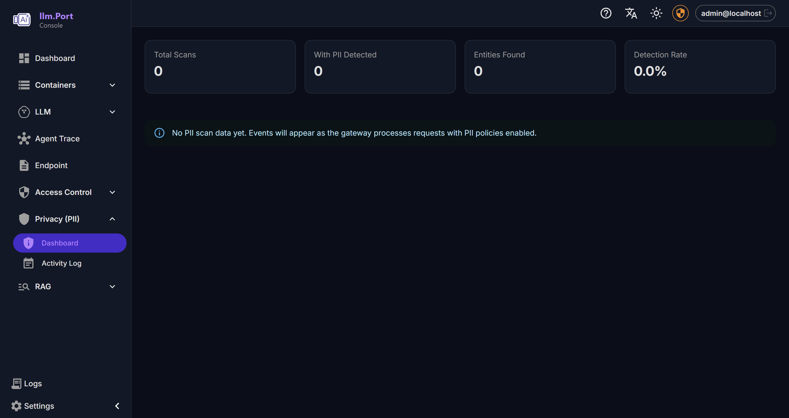

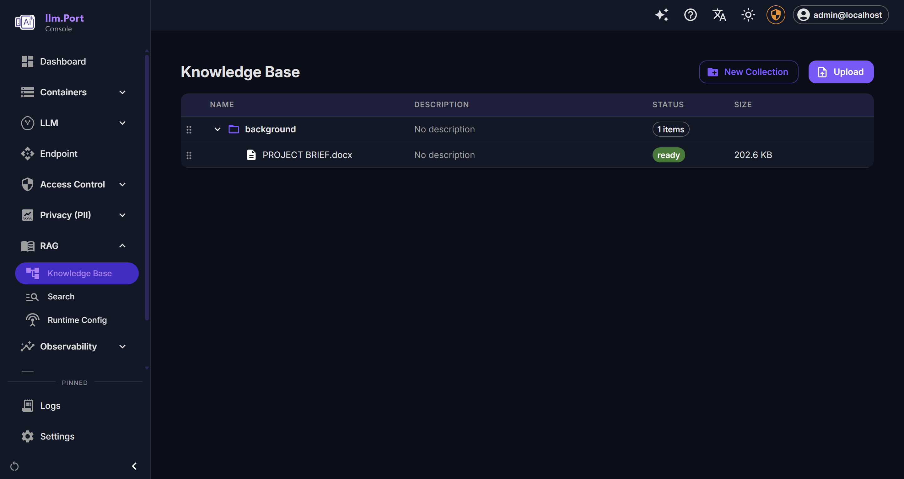

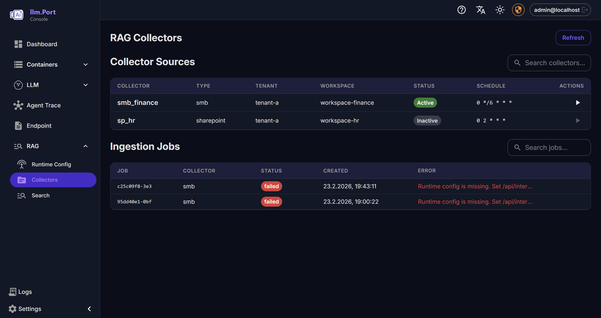

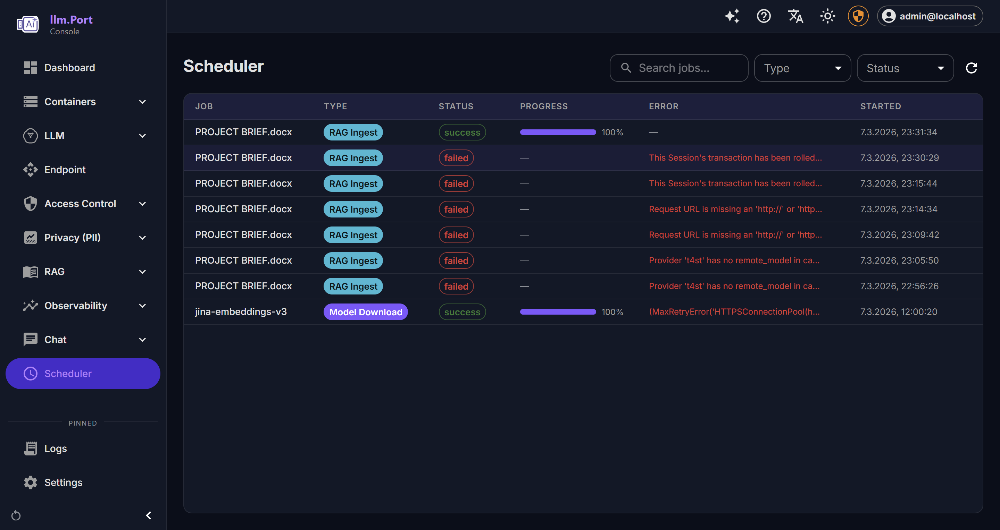

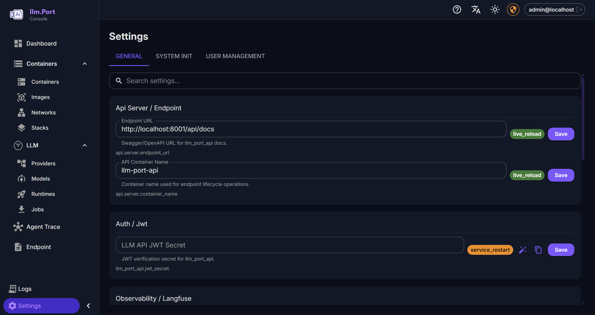

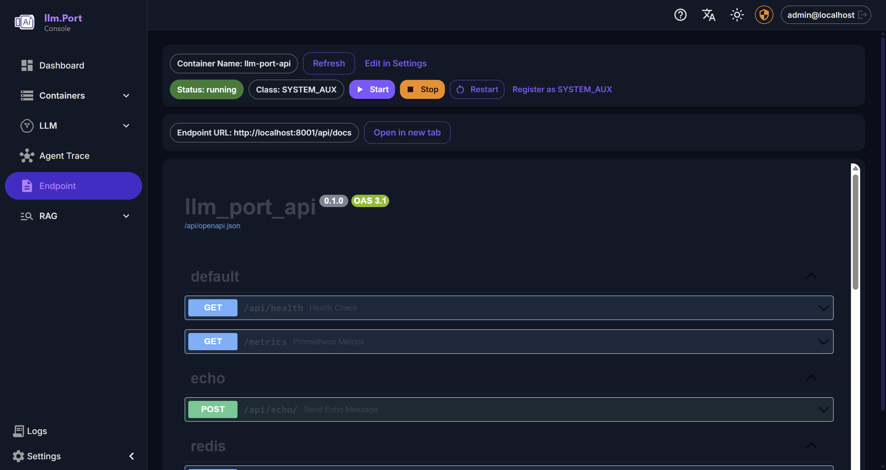

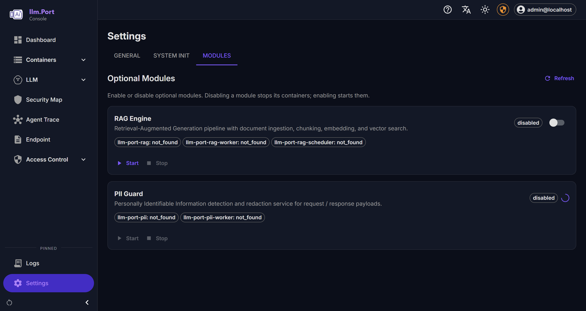

---

## What it does

### ✅ Today

**Gateway & Routing**

- **One endpoint for all apps**: OpenAI-compatible API (`/v1/models`, `/v1/chat/completions`, `/v1/embeddings`)
- **Provider routing layer**: local runtimes (vLLM, llama.cpp, Ollama, TGI) and remote providers (OpenAI, Azure, …)
- **Alias-based model resolution**: multi-tenant routing to pools of provider instances
- **SSE streaming**: passthrough streaming with TTFT extraction and idle timeout handling
- **Proxy & retry**: upstream HTTP proxy with configurable timeout and pre-first-token retry

**Chat & Sessions**

- **Built-in chat console**: project-scoped conversations with per-session message history
- **Session management**: full CRUD for projects, sessions, and messages via API
- **Drag-and-drop organisation**: drag sessions between projects in the sidebar (dnd-kit)
- **Streaming with usage tracking**: real-time SSE streaming with token usage and response-time display
- **Error resilience**: error bubbles with one-click retry, reloading detects incomplete exchanges
- **Memory system**: persistent user-defined facts (project or session scope) injected into context automatically
- **File attachments**: upload files to sessions or projects with automatic text extraction
- **Document processing**: IBM Docling integration for rich extraction (tables, pages, images) with local fallback
- **Session context injection**: memory facts + attachment text assembled into chat context at completion time
- **Admin oversight**: backend mirror routes for admin management of all chat activity
- **RAG Lite**: embedded pgvector-based retrieval when the full RAG engine is not enabled
- **Dark / light mode**: mode-aware chat bubble theming with asymmetric bubble shapes

**Security & Policy**

- **Full RBAC**: resource + action permission model with roles, groups, and user assignment
- **JWT authentication**: bearer tokens with tenant-aware claims across gateway and admin APIs
- **OAuth / SSO**: OIDC/OAuth2 provider management with auto-registration and group mapping via dedicated auth service
- **Root mode / Break-glass**: time-limited elevated sessions with mandatory audit trail
- **Rate limiting**: Redis-based fixed-window RPM and TPM per tenant
- **Concurrency control**: distributed per-instance leasing via Redis + Lua scripts
- **Request body limits**: configurable max payload size enforcement
- **DB-stored secrets**: Fernet-encrypted secrets with a single master key — no secrets in env vars
- **Column-level encryption**: sensitive model fields (API keys, tokens) encrypted at rest via per-field Fernet keys

**PII Detection & Redaction**

- **Presidio-based** standalone service for PII scanning, redaction, and reversible tokenization
- **Gateway-integrated**: per-tenant PII policies for telemetry sanitization and egress control
- **System default + tenant override** policy precedence (`tenant > system default > none`)
- **Configurable entity types**: PERSON, EMAIL, PHONE, CREDIT_CARD, SSN, IP_ADDRESS, etc.
- **Fail modes**: block, allow, or active fallback-to-local on PII egress failures
- **Module-aware admin UX**: PII enablement owned by Modules tab; settings are hidden when module is disabled

**Observability**

- **Langfuse tracing**: full trace/generation events with privacy modes (full / redacted / metadata_only)
- **Centralized logging**: Loki + Alloy log collection, queryable via Grafana and admin API
- **Audit logging**: every gateway request and admin action logged with full context
- **Token usage tracking**: extraction from OpenAI payloads + heuristic input estimation
- **OpenTelemetry**: collector + Jaeger support for distributed tracing
- **Dashboard**: system overview, health checks, container stats, Grafana panel embeds

**Notifications & Alerts**

- **Outbox pattern**: event-driven notification pipeline with persistent outbox and background dispatcher
- **Email delivery**: dedicated mailer service with Jinja2-templated messages (password reset, admin alerts, invites)
- **Alert deduplication**: fingerprint-based suppression with configurable cooldown window
- **Retry with backoff**: exponential retry for transient delivery failures
- **Grafana webhook integration**: system health alerts routed through the notification pipeline

**Ops Console**

- **Container management**: lifecycle controls (start/stop/restart/pause), exec, log streaming
- **Image management**: pull with SSE progress, list, prune
- **Compose stack management**: deploy/update/rollback with revisions, diffs, and audit trail
- **Container classification**: SYSTEM_CORE / SYSTEM_AUX / LLM_ENGINE / TENANT_APP with per-class policy
- **Network visibility**: Docker network inspection and system/user classification

**LLM Runtime Management**

- **Provider adapter registry**: pluggable adapters for vLLM, llama.cpp, Ollama, TGI
- **Multi-vendor GPU support**: auto-detection for NVIDIA (CUDA), AMD (ROCm), Intel, and Apple Metal
- **vLLM image presets**: automatic image selection (CUDA / ROCm / Legacy CUDA for CC ≥ 7.0)
- **Model scanner**: auto-detects artifact format (safetensors, GGUF) and recommends compatible runtimes
- **Model download**: Docker-orchestrated HuggingFace downloads with pull tracking
- **LLM topology graph**: visual topology + trace browser with SSE streaming

**System Configuration**

- **Settings registry**: code-defined typed settings (string, int, bool, secret, json, enum)
- **Init wizard**: guided multi-step setup for shared services and gateway configuration
- **Module lifecycle**: dynamic enable/disable of optional services (PII, Auth, RAG, Docling, Mailer, Sessions) with Docker Compose profiles and sync callbacks
- **Auto-tune**: CLI command (`llmport tune`) that benchmarks host resources and auto-configures worker counts, DB pool sizes, and resource limits
- **Infrastructure agents**: remote agent registration, heartbeat, and distributed apply
- **Apply orchestration**: live-reload vs. service-restart vs. stack-recreate, routed to local or remote executors

**RAG (Retrieval)**

- **Knowledge search**: vector, keyword, or hybrid scoring with filters and ACL enforcement
- **Multi-tenant**: partitioning by tenant + optional workspace, with chunk-level ACL principals
- **Virtual containers**: N-level container tree with assets, versions, and draft/publish workflows
- **Upload pipeline**: presigned URL → MinIO → Docling extract → normalize → chunk → embed → index (pgvector)
- **Collector plugins**: pluggable connectors (local folder/SMB, SharePoint stub, extensible registry)
- **Runtime embedding config**: embedding provider/model and chunking policy pushed from control plane
- **Async processing**: Taskiq + RabbitMQ for ingestion, publishing, and scheduled collector syncs

**CLI**

- **System management**: `up`, `down`, `status`, `logs`, `config`, `module enable/disable`
- **Production installer**: interactive setup wizard with GPU auto-detection and TUI
- **Dev workflow**: `dev init` (clone repos + install deps + start infra + run migrations)
- **Auto-tune**: `tune` command benchmarks host CPU, memory, and disk to generate optimal worker and pool settings
- **Health checks**: `doctor` command validates OS, Docker, Compose, GPU, RAM, disk, and port availability
- **Env generation**: `.env` file generation for dev and production with random secret generation

**Internationalization**

- **4 languages**: English, German, Spanish, Chinese
- **Runtime-loaded**: JSON bundles served by backend — new languages added without frontend recompilation

### 🚧 In progress

- **Workspace/tenant retrieval scope**: strict isolation and policy-driven access in RAG

### 🧭 Planned

- More runtimes (TensorRT-LLM, etc.)
- More providers (additional managed APIs)
- Model rollout workflows (staged deploy, canary, rollback)
- Fine-grained cost controls and usage analytics
- Backup/restore for shared services
- More collector plugins (Google Drive, Confluence, S3)

---

## Why it matters

You get **sovereign-by-default AI**: keep data on-prem when needed, use remote providers when allowed —
without changing your apps or losing governance and observability.

---

## Repository layout

| Repo                | Description                                                                               |
| ------------------- | ----------------------------------------------------------------------------------------- |
| `llm-port-frontend` | React admin console UI (React Router + MUI)                                               |
| `llm-port-backend`  | FastAPI control-plane: users, RBAC, LLM management, system settings, Docker orchestration |
| `llm-port-api`      | OpenAI-compatible V1 gateway service with sessions, memory, and attachments (FastAPI)     |
| `llm-port-pii`      | PII detection and redaction service (FastAPI + Presidio)                                  |
| `llm-port-rag`      | RAG subsystem: vector/keyword/hybrid search, pgvector, MinIO, collector plugins           |
| `llm-port-cli`      | CLI installer and management tool (Click + Textual TUI)                                   |
| `llm-port-cli-ee`   | Enterprise CLI wrapper with license management                                            |
| `llm-port-ee`       | Enterprise Edition license framework and shared EE infrastructure                         |
| `llm-port-docling`  | Document processing service (IBM Docling)                                                 |
| `llm-port-mailer`   | Email delivery service for notifications and alerts                                       |
| `llm-port-auth`     | SSO / OIDC authentication service                                                         |
| `llm-port-shared`   | Shared Docker Compose stack: Postgres, Redis, Grafana, Loki, Alloy, Langfuse              |

> Visibility note: the org is public, but some repos may be private temporarily while we are finalizing and cleaning things up.

---

## Getting started

### Prerequisites

- Docker Engine 24+ with Compose V2
- Git
- Python 3.12+ (or [uv](https://docs.astral.sh/uv/) — recommended)
- Node.js 20+

### Install the CLI

```bash
pip install llmport-cli
```

### Check prerequisites

```bash
llmport dev doctor            # check all prerequisites
llmport dev doctor --install  # auto-install missing tools (uv, git, node)
```

### Bootstrap a dev workspace

```bash
llmport dev init ~/projects/llm-port
```

This will:

1. Clone all public repositories
2. Install Python (`uv sync`) and Node.js (`npm install`) dependencies
3. Start shared infrastructure (Postgres, Redis, Grafana, Loki)
4. Run database migrations
5. Generate `.env` files with development defaults
6. Create a VS Code multi-root workspace file

### Launch the dev environment

```bash
llmport dev up       # start backend + worker + frontend
llmport dev status   # check repo branches and service status
```

### Production deployment

```bash
llmport doctor       # full system health check (Docker, RAM, disk, GPU, ports)
llmport up           # start all services via docker compose
llmport status       # running container status
llmport module list  # show available modules
```

For more details see the [full documentation](https://llm-port.github.io).

If you want early access or to be a design partner, open an issue/discussion in this repo.

---

## Contributing

Contributions are welcome. If you'd like to help early, feel free to get in contact.

---

## License

Apache 2.0

Third-party components: llm.port deploys and integrates several upstream open-source services via Docker images (e.g., PostgreSQL/pgvector, ClickHouse, RabbitMQ, Grafana/Loki, Langfuse, MinIO). Each component remains licensed by its respective authors under its original license terms. See [THIRD_PARTY_NOTICES.md](./THIRD_PARTY_NOTICES.md) for the full list, versions, and licenses.

> Some optional components use strong copyleft or source-available licenses (e.g., AGPLv3, SSPL/RSAL). If your organization has restrictions around these licenses, disable the relevant compose profiles or substitute compatible alternatives.
