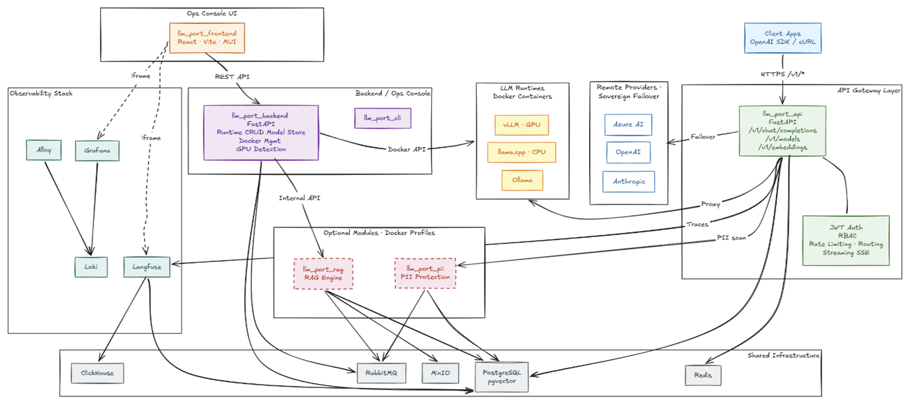

# llm.port

**llm.port** is a self-hosted **all-in-one LLM platform** that combines:

- an OpenAI-compatible gateway for app traffic
- control-plane operations for model servers and runtime infrastructure
- an internal RAG subsystem for ingestion, indexing, and governed retrieval
- PII detection and redaction integrated into the gateway pipeline

It **routes, secures, and observes** traffic across **local LLM runtimes** _and_ **remote providers**, while giving teams a single place to manage LLM services end-to-end.

## Architecture

---

## Screenshots

---

## What it does

### ✅ Today

**Gateway & Routing**

- **One endpoint for all apps**: OpenAI-compatible API (`/v1/models`, `/v1/chat/completions`, `/v1/embeddings`)
- **Provider routing layer**: local runtimes (vLLM, llama.cpp, Ollama, TGI) and remote providers (OpenAI, Azure, …)
- **Alias-based model resolution**: multi-tenant routing to pools of provider instances
- **SSE streaming**: passthrough streaming with TTFT extraction and idle timeout handling
- **Proxy & retry**: upstream HTTP proxy with configurable timeout and pre-first-token retry

**Security & Policy**

- **Full RBAC**: resource + action permission model with roles, groups, and user assignment
- **JWT authentication**: bearer tokens with tenant-aware claims across gateway and admin APIs
- **OAuth / SSO**: OIDC/OAuth2 provider management with auto-registration and group mapping
- **Root mode / Break-glass**: time-limited elevated sessions with mandatory audit trail
- **Rate limiting**: Redis-based fixed-window RPM and TPM per tenant
- **Concurrency control**: distributed per-instance leasing via Redis + Lua scripts
- **Request body limits**: configurable max payload size enforcement
- **DB-stored secrets**: Fernet-encrypted secrets with a single master key — no secrets in env vars

**PII Detection & Redaction**

- **Presidio-based** standalone service for PII scanning, redaction, and reversible tokenization
- **Gateway-integrated**: per-tenant PII policies for telemetry sanitization and egress control
- **System default + tenant override** policy precedence (`tenant > system default > none`)
- **Configurable entity types**: PERSON, EMAIL, PHONE, CREDIT_CARD, SSN, IP_ADDRESS, etc.
- **Fail modes**: block, allow, or active fallback-to-local on PII egress failures
- **Module-aware admin UX**: PII enablement owned by Modules tab; settings are hidden when module is disabled

**Observability**

- **Langfuse tracing**: full trace/generation events with privacy modes (full / redacted / metadata_only)
- **Centralized logging**: Loki + Alloy log collection, queryable via Grafana and admin API
- **Audit logging**: every gateway request and admin action logged with full context
- **Token usage tracking**: extraction from OpenAI payloads + heuristic input estimation
- **OpenTelemetry**: collector + Jaeger support for distributed tracing
- **Dashboard**: system overview, health checks, container stats, Grafana panel embeds

**Ops Console**

- **Container management**: lifecycle controls (start/stop/restart/pause), exec, log streaming
- **Image management**: pull with SSE progress, list, prune
- **Compose stack management**: deploy/update/rollback with revisions, diffs, and audit trail
- **Container classification**: SYSTEM_CORE / SYSTEM_AUX / LLM_ENGINE / TENANT_APP with per-class policy
- **Network visibility**: Docker network inspection and system/user classification

**LLM Runtime Management**

- **Provider adapter registry**: pluggable adapters for vLLM, llama.cpp, Ollama, TGI
- **Multi-vendor GPU support**: auto-detection for NVIDIA (CUDA), AMD (ROCm), Intel, and Apple Metal
- **vLLM image presets**: automatic image selection (CUDA / ROCm / Legacy CUDA for CC ≥ 7.0)
- **Model scanner**: auto-detects artifact format (safetensors, GGUF) and recommends compatible runtimes
- **Model download**: Docker-orchestrated HuggingFace downloads with pull tracking
- **LLM topology graph**: visual topology + trace browser with SSE streaming

**System Configuration**

- **Settings registry**: code-defined typed settings (string, int, bool, secret, json, enum)
- **Init wizard**: guided multi-step setup for shared services and gateway configuration
- **Infrastructure agents**: remote agent registration, heartbeat, and distributed apply
- **Apply orchestration**: live-reload vs. service-restart vs. stack-recreate, routed to local or remote executors

**RAG (Retrieval)**

- **Knowledge search**: vector, keyword, or hybrid scoring with filters and ACL enforcement
- **Multi-tenant**: partitioning by tenant + optional workspace, with chunk-level ACL principals
- **Virtual containers**: N-level container tree with assets, versions, and draft/publish workflows
- **Upload pipeline**: presigned URL → MinIO → extract → normalize → chunk → embed → index (pgvector)
- **Collector plugins**: pluggable connectors (local folder/SMB, SharePoint stub, extensible registry)
- **Runtime embedding config**: embedding provider/model and chunking policy pushed from control plane
- **Async processing**: Taskiq + RabbitMQ for ingestion, publishing, and scheduled collector syncs

**CLI**

- **System management**: `up`, `down`, `status`, `logs`, `config`, `module enable/disable`
- **Production installer**: interactive setup wizard with GPU auto-detection and TUI
- **Dev workflow**: `dev init` (clone repos + install deps + start infra + run migrations)
- **Health checks**: `doctor` command validates OS, Docker, Compose, GPU, RAM, disk, and port availability
- **Env generation**: `.env` file generation for dev and production with random secret generation

**Internationalization**

- **4 languages**: English, German, Spanish, Chinese
- **Runtime-loaded**: JSON bundles served by backend — new languages added without frontend recompilation

### 🚧 In progress

- **Workspace/tenant retrieval scope**: strict isolation and policy-driven access in RAG

### 🧭 Planned

- More runtimes (TensorRT-LLM, etc.)
- More providers (additional managed APIs)
- Model rollout workflows (staged deploy, canary, rollback)
- Fine-grained cost controls and usage analytics
- Backup/restore for shared services

---

## Why it matters

You get **sovereign-by-default AI**: keep data on-prem when needed, use remote providers when allowed —
without changing your apps or losing governance and observability.

---

## Repository layout

| Repo                | Description                                                                                 |
| ------------------- | ------------------------------------------------------------------------------------------- |
| `llm-port-frontend` | React admin console UI (Vite + React Router)                                                |
| `llm-port-backend`  | FastAPI control-plane: users, RBAC, LLM management, system settings, Docker orchestration   |
| `llm-port-api`      | OpenAI-compatible V1 gateway service (FastAPI)                                              |
| `llm-port-rag`      | Internal RAG subsystem: ingestion, knowledge search, collector plugins (FastAPI + pgvector) |
| `llm-port-pii`      | PII detection and redaction service (FastAPI + Presidio)                                    |
| `llm-port-cli`      | CLI installer and management tool (Click + Textual TUI)                                     |
| `llm-port-shared`   | Shared Docker Compose stack: Postgres, Redis, Grafana, Loki, Alloy                          |
| `llm-port-dev`      | Project documentation, feature specs, infrastructure docs, dev scripts                      |

> Visibility note: the org is public, but some repos may be private temporarily while we are finalizing and cleaning things up.

---

## Getting started (preview)

Until the public quickstart is finalized, the intended flow is:

1. Start shared services (Postgres, Redis, Grafana, Loki)
2. Start the control-plane backend
3. Run the init wizard to configure secrets, providers, and gateway settings
4. Add providers (remote) and/or runtimes (local)
5. Point your apps to the OpenAI-compatible endpoint

If you want early access or to be a design partner, open an issue/discussion in this repo.

---

## Contributing

Contributions are welcome. If you'd like to help early, feel free to get in contact.

---

## License

Apache 2.0
