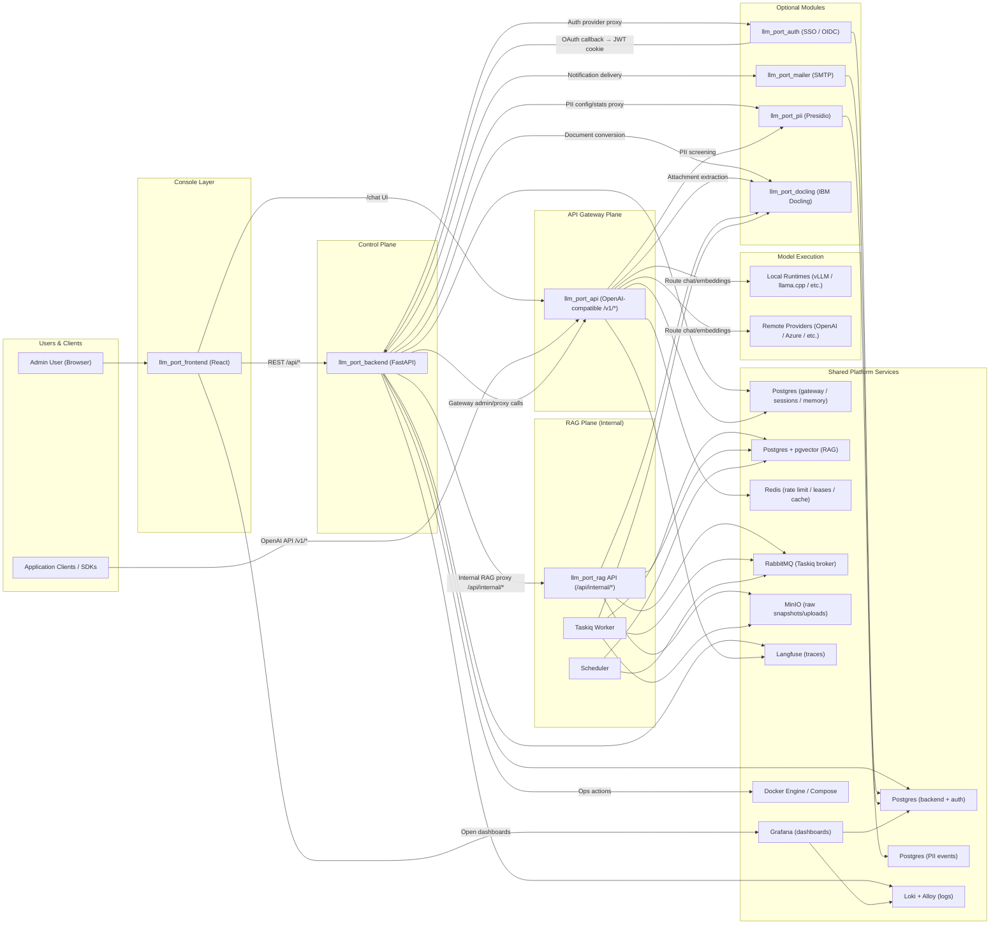

# llm.port Architecture

This diagram shows the complete platform components and who calls whom.

## Calling-Service Paths

1. **Admin operations path**
   `Browser → llm_port_frontend → llm_port_backend → Docker / Settings / Proxy targets`

2. **Application inference path**
   `App/SDK → llm_port_api → local runtime or remote provider → response`

3. **Chat completions path (console)**
   `Browser → llm_port_frontend → llm_port_backend (cookie→JWT proxy) → llm_port_api /v1/chat/completions → provider → SSE response`

4. **RAG query path**
   `Browser → llm_port_frontend → llm_port_backend /api/admin/rag/* → llm_port_rag /api/internal/knowledge/search`

5. **RAG publish path**
   `Browser upload → presigned MinIO upload → draft/publish API → RabbitMQ task → Taskiq worker → Docling extract → chunk → embed → pgvector index`

6. **PII screening path**
   `llm_port_api (pre-forward middleware) → llm_port_pii /analyze → redact/flag → continue or reject`

7. **SSO authentication path**
   `Browser → llm_port_auth /login/<provider> → IdP → llm_port_auth /callback → signed JWT → llm_port_backend (set cookie)`

8. **Notification delivery path**
   `llm_port_backend (outbox write) → dispatcher → llm_port_mailer /send → SMTP provider`

9. **Document processing path**
   `File upload → llm_port_docling /convert → IBM Docling pipeline → structured text → caller (RAG worker / gateway)`

10. **Observability path**
    `backend + gateway + rag → Loki/Langfuse → Grafana dashboards`
