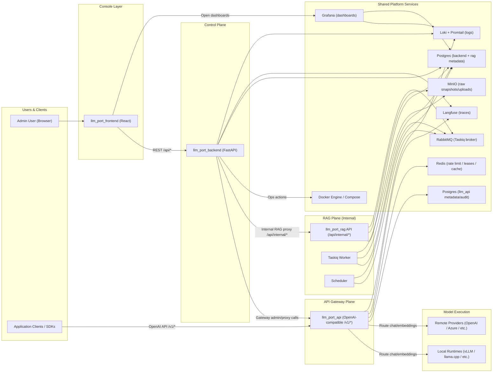

# llm.port Architecture

This diagram shows the complete platform components and who calls whom.

## Calling-Service Paths

1. **Admin operations path**
   `Browser -> llm_port_frontend -> llm_port_backend -> Docker/Settings/Proxy targets`

2. **Application inference path**
   `App/SDK -> llm_port_api -> local runtime or remote provider -> response`

3. **RAG query path**
   `Browser -> llm_port_frontend -> llm_port_backend /api/admin/rag/* -> llm_port_rag /api/internal/knowledge/search`

4. **RAG publish path**
   `Browser upload -> presigned MinIO upload -> draft/publish API -> RabbitMQ task -> Taskiq worker -> extract/chunk/embed/index`

5. **Observability path**
   `backend + gateway + rag -> Loki/Langfuse -> Grafana dashboards`

