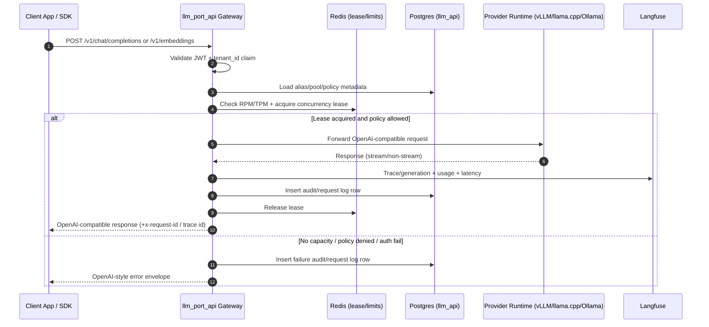
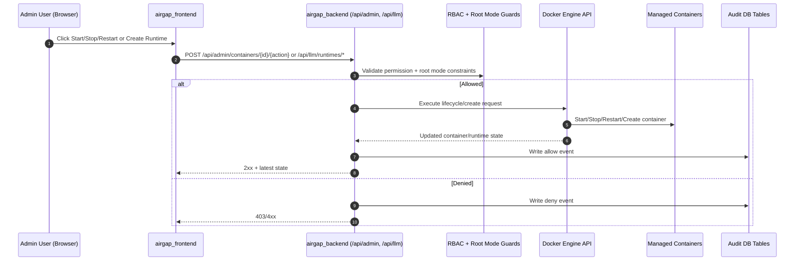
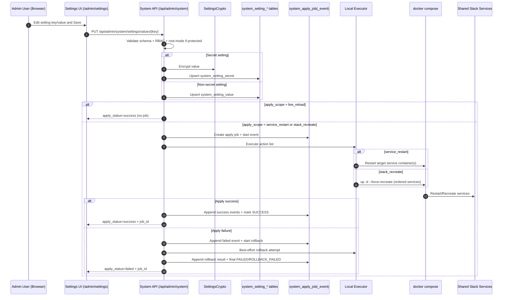
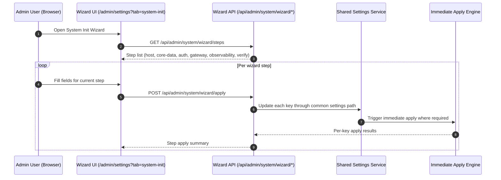
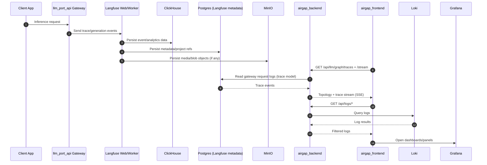
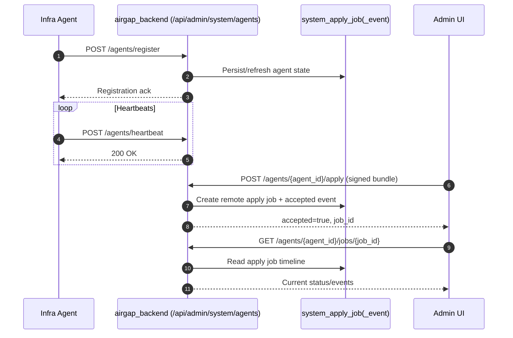

# llm.port - End-to-End Call Sequences

This document captures the main runtime and control-plane interactions across frontend, backend, gateway, and shared services.

## 1) OpenAI-Compatible Inference (Chat/Embeddings)

## 2) Admin Console - Container and Runtime Operations

## 3) System Settings Update + Immediate Apply

## 4) System Initialization Wizard

## 5) LLM Tracing and Observability Pipeline

## 6) Agent Contract (Multi-Host Ready Path)

